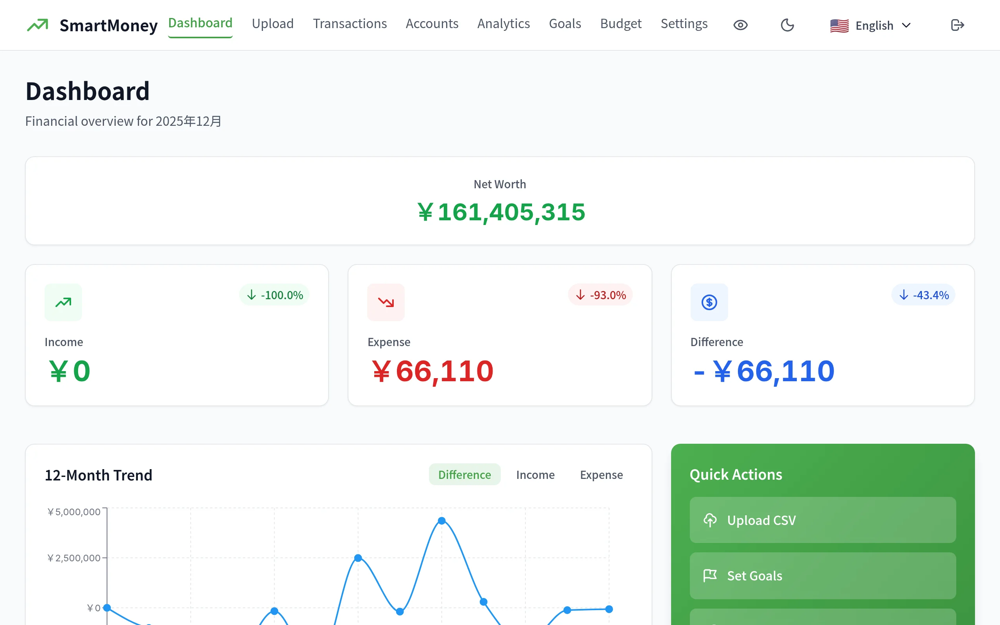

# SmartMoney Cashflow Tracker

**Version:** v0.2.4 | **Status:** ✅ Production Live | **Live Demo:** [money.khanh.page](https://money.khanh.page)

Privacy-first personal finance app with AI-powered budgets. Self-hosted, multi-currency, multilingual.



## Features

- 📊 **CSV Import** - MoneyForward, Zaim (Shift-JIS/UTF-8 auto-detect)
- 🤖 **AI Budgets** - Claude AI generates personalized budgets from spending patterns
- 💰 **Multi-Currency** - JPY, USD, VND with real-time exchange rates
- 🎯 **Goal Tracking** - 1/3/5/10 year goals with progress projections
- 📸 **Receipt Scanning** - OCR-powered receipt capture (mobile)
- ⚡ **Quick Entry** - 3-4 tap transaction entry with calculator numpad
- 🌙 **Dark Mode** - System preference + manual toggle
- 🌐 **Multilingual** - English, Japanese, Vietnamese
- 🔒 **Self-Hosted** - Privacy-first, no cloud data sharing
- 📱 **PWA Ready** - Installable, offline-capable

## Tech Stack

**Backend:**
- Python 3.11+ / FastAPI
- SQLAlchemy ORM
- SQLite (MVP) → PostgreSQL (production)
- Pandas for CSV parsing

**Frontend:**
- React 18 + TypeScript
- Vite build tool
- Recharts for visualizations
- Tailwind CSS + Shadcn/ui

## Quick Start

### Backend

```bash
cd backend
python -m venv venv
source venv/bin/activate  # Windows: venv\Scripts\activate
pip install -e ".[dev]"
fastapi dev app/main.py
```

Backend runs at http://localhost:8000

### Frontend

```bash
cd frontend
npm install
npm run dev
```

Frontend runs at http://localhost:5173

## Documentation

**Start Here:**
- [📚 Documentation Index](./docs/README.md) - Navigation hub for all docs

**Core Documentation:**
- [📋 Project Overview & PDR](./docs/project-overview-pdr.md) - Vision, requirements, success criteria
- [🏗️ System Architecture](./docs/system-architecture.md) - Architecture diagrams, data flows
- [📝 Code Standards](./docs/code-standards.md) - Python/TypeScript standards, testing
- [📦 Codebase Summary](./docs/codebase-summary.md) - Project structure, key modules

**Technical Guides:**
- [🗄️ Database Schema](./docs/tech-stack-database.md) - Models, migrations, queries
- [🚀 Deployment Guide](./docs/tech-stack-deployment.md) - Local setup, VPS deployment
- [🎨 Design Guidelines](./docs/design-guidelines.md) - UI/UX, typography, colors

## Project Structure

```
smartmoney/
├── backend/          # FastAPI backend (Python 3.11+)
│   ├── app/
│   │   ├── models/   # SQLAlchemy models (3 files)
│   │   ├── routes/   # API endpoints (4 files)
│   │   ├── services/ # Business logic (3 files)
│   │   ├── schemas/  # Pydantic validation (3 files)
│   │   └── utils/    # CSV parser, hashing (6 files)
│   ├── tests/        # pytest (89 tests passing)
│   └── alembic/      # Database migrations
├── frontend/         # React frontend (TypeScript)
│   └── src/
│       ├── components/ # 24 components (charts, dashboard, UI)
│       ├── pages/      # 6 pages (Dashboard, Upload, etc.)
│       ├── services/   # 6 API clients
│       ├── types/      # TypeScript types
│       └── utils/      # Formatters, calculations
└── docs/             # Documentation (15+ files)
```

## Screenshots

| Dashboard | Transactions | Budget |
|-----------|-------------|--------|
|  |  |  |

## Current Status

**✅ Production Features:**
- JWT Authentication with user isolation
- Multi-currency accounts (JPY, USD, VND)
- AI-powered budget generation (Claude)
- Receipt scanning with OCR
- Quick Entry FAB with currency conversion
- Dark mode + i18n (EN/JA/VI)
- PWA with offline support
- Docker deployment on Hetzner VPS

**📊 Metrics:**
- Response Time: <500ms (dashboard)
- Build Time: ~3s (production)
- Bundle Size: ~340KB gzipped

## License

MIT License - Open Source
